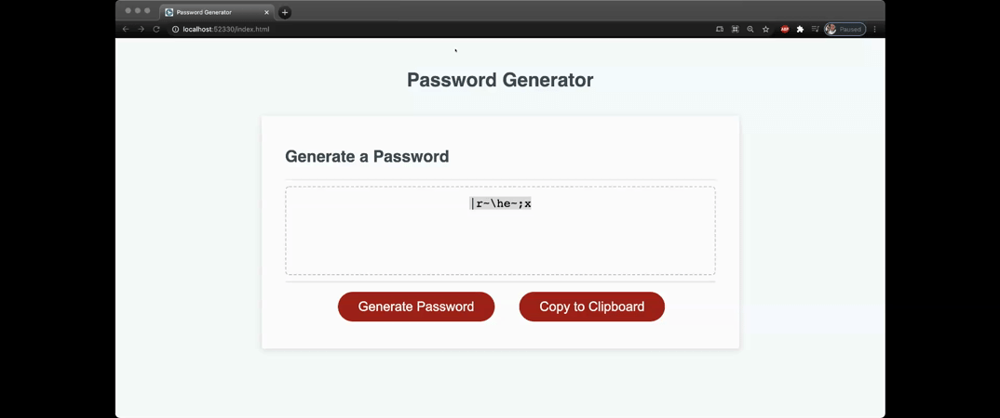

# Password Generator 

  

  ##Table of Contents:
  
    
  ## Description:
  This is a javascript application that creates a random password from a set on letters, numbers and symbols.  You can tell your password to be anywhere from 8 to 128 characters long.

  ### Installation:
  Open the HTML file.  Once loaded, click on "Generate Password" and follow prompts.

   

  ### Usage:
  Use this to create a random password between 8-128 characters

  ### Contributions:
  None, but feel free to

  ### Tests:
  None

  ### License:

  
  ## Questions.
  ### GitHub:
  [Chamilitary216](https://github.com/Chamilitary216/PasswordGenerator)

  ### Email:
  ChrisCurryCodez@gmail.com